# Customer Segmentation with Cluster Analysis

In this project, I analyzed over 500,000 retail transactions from an online store to group customers into distinct segments based on their purchasing behavior. The idea is similar to how a store manager might intuitively recognize "regulars," "big spenders," and "one-time shoppers" — except I used machine learning to do it systematically across 4,312 customers. I engineered eight behavioral features for each customer (like how recently they purchased, how often they buy, and how much they spend), applied K-Means clustering, and identified five distinct customer segments — each with unique characteristics and actionable marketing strategies. I also validated the results by comparing K-Means against two alternative algorithms (Agglomerative Clustering and DBSCAN) and confirmed that K-Means provides the best balance of statistical quality and business interpretability.

---

## Dataset Overview

The data comes from the Online Retail II dataset from the UCI Machine Learning Repository, containing transactions from a UK-based online retailer between December 2009 and December 2010.

| Property | Value |
|----------|-------|
| Raw Transactions | 525,461 |
| Transactions After Cleaning | 407,664 |
| Unique Customers | 4,312 |
| Unique Products | 4,632 |
| Countries Represented | 40 |
| Date Range | Dec 2009 - Dec 2010 |
| Records Removed | 117,797 (22.4%) |

**Data cleaning steps:** I removed cancelled orders (invoices starting with "C"), transactions with missing customer IDs (guest checkouts), and records with invalid quantities or prices. This removed 22.4% of the raw data, leaving 407,664 clean transaction records from 4,312 identifiable customers.

---

## Exploratory Data Analysis

### Missing Values

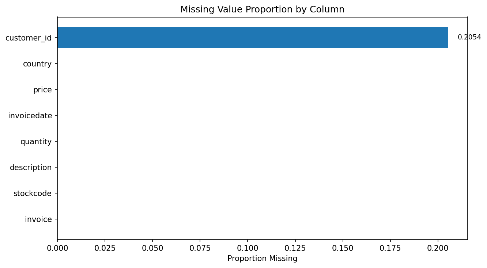

This chart shows the proportion of missing data in each column. The customer_id field has the most missing values at about 20.5% — these represent guest checkouts where no customer account was used. Since I cannot track purchasing behavior without a customer ID, these records were removed during cleaning. All other fields are nearly complete.

### Transaction Distributions

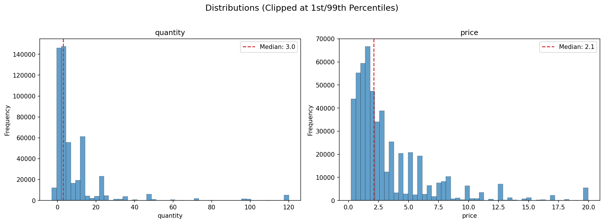

These histograms show the distribution of transaction quantities and prices. Both are heavily right-skewed — most transactions involve small quantities and low prices, but a few involve very large orders. I clipped the display at the 1st and 99th percentiles to keep the charts readable. This extreme skewness is why I applied logarithmic transformations before clustering.

### Transaction Volume Over Time

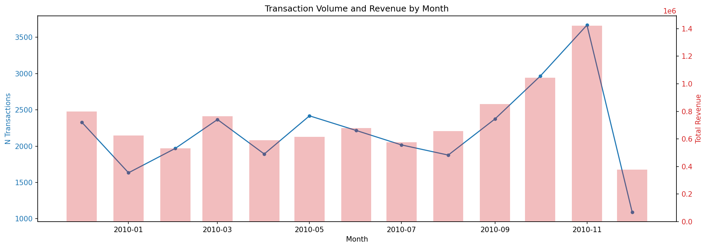

This dual-axis chart shows monthly transaction count (bars) and total revenue (line) over the dataset period. There is a clear spike in late 2010, likely driven by holiday shopping. Understanding these temporal patterns helps put the customer segments in context — some customers may appear "lapsed" simply because the data ends shortly after their purchase.

### Geographic Distribution

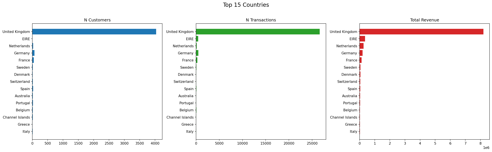

These three panels show the top 15 countries by number of customers, transactions, and revenue. The United Kingdom dominates across all three measures, which is expected for a UK-based retailer. International customers, while fewer, contribute meaningfully to revenue.

### Cancellation Rate

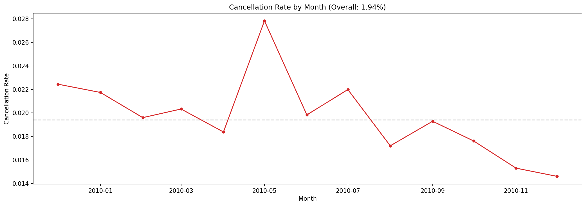

This time series shows the monthly cancellation rate. The overall rate is approximately 2%, which is relatively low. I removed all cancelled transactions from the analysis to ensure the customer features reflect actual purchasing behavior rather than being distorted by returns and cancellations.

### RFM Feature Preview

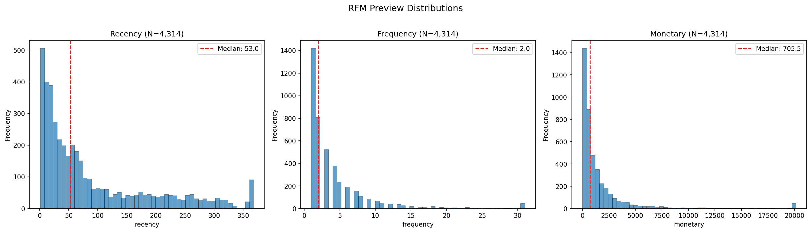

These histograms preview the three core customer features — Recency (days since last purchase), Frequency (number of orders), and Monetary value (total spending). All three are heavily right-skewed: most customers purchased recently, bought only a few times, and spent modest amounts, while a small number of "power buyers" show extreme values on all three dimensions.

### Feature Correlations

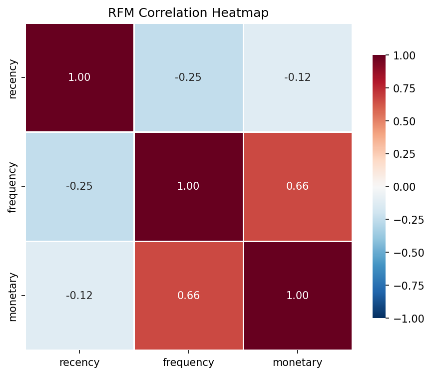

This heatmap shows how the customer features relate to each other. Frequency and Monetary value have a moderate positive correlation (customers who buy more often also tend to spend more), while Recency has a weak negative correlation with both (active customers tend to have both higher frequency and higher spending). These relationships are expected and confirm the features capture different but related dimensions of behavior.

---

## Feature Engineering

I transformed the raw transaction data into eight customer-level features that capture different aspects of purchasing behavior.

| Feature | Description | Mean | Median |
|---------|-------------|------|--------|
| Recency | Days since last purchase | 91 days | 53 days |
| Frequency | Number of unique orders | 4.5 | 2 |
| Monetary | Total revenue (quantity x price) | $2,048 | $706 |
| Avg Order Value | Average revenue per order | $378 | $287 |
| Avg Items Per Order | Average total items per order | 256 | 152 |
| Unique Products | Distinct products purchased | 64 | 38 |
| Avg Unit Price | Average price per item purchased | $9.86 | $2.97 |
| Tenure Days | Days between first and last purchase | 134 | 105 |

### Feature Distributions After Engineering

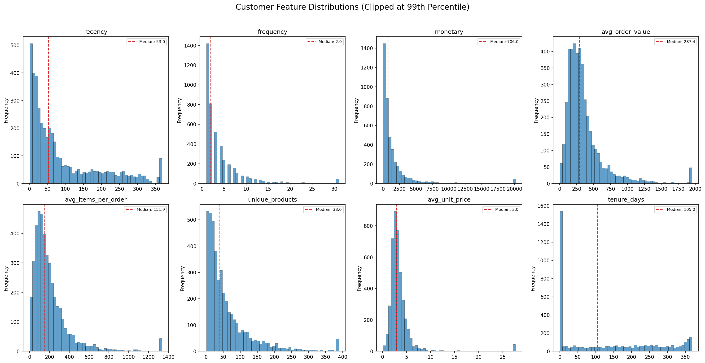

These eight histograms show the distribution of each customer feature. Nearly all features are heavily right-skewed, confirming the need for logarithmic transformation before clustering. Without this transformation, the clustering algorithm would be dominated by a handful of extreme customers, producing segments that are not useful for the majority of the customer base.

### Feature Correlation Matrix

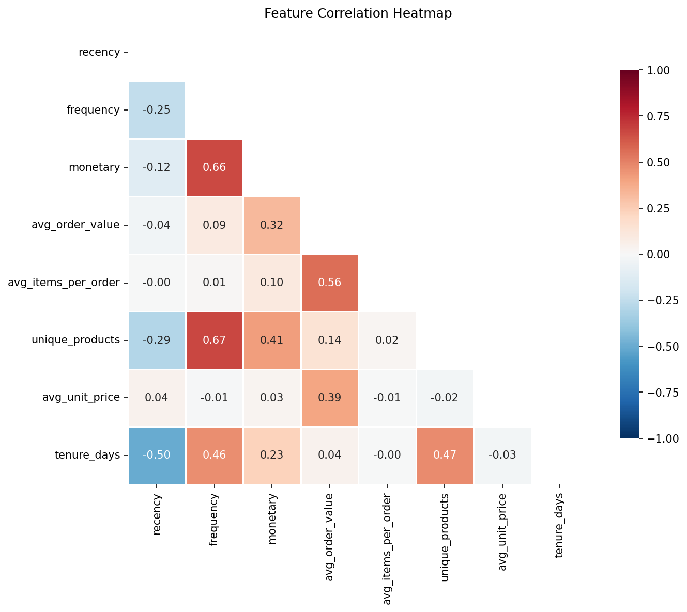

This correlation heatmap of all eight engineered features shows that while some features are related (e.g., frequency and unique products), most capture distinct behavioral dimensions. Low-to-moderate correlations confirm that each feature contributes unique information to the clustering, and I am not wasting model capacity on redundant signals.

---

## Clustering

### Preprocessing for Clustering

Before running K-Means, I applied two transformations to ensure fair clustering:
1. **Log transformation** on six right-skewed features to compress the long tails
2. **Z-score standardization** on all eight features so each has mean = 0 and standard deviation = 1

This ensures no single feature dominates the distance calculations simply because of its scale (e.g., monetary values in the thousands vs. frequency counts in single digits).

### Choosing the Number of Clusters

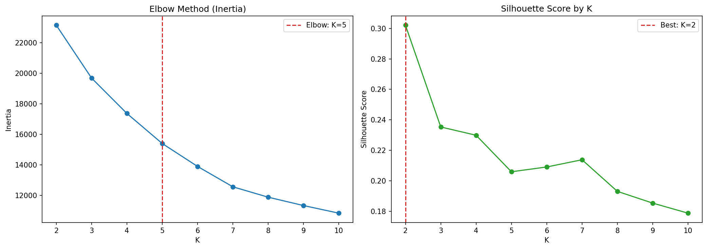

I tested cluster counts from 2 to 10 using two complementary methods. The **elbow plot** (left) shows how compactly the clusters group together — the "elbow" at K=5 indicates diminishing returns from adding more clusters. The **silhouette score** (right) measures how well each customer fits within their assigned cluster versus neighboring clusters. While K=2 has the highest silhouette score (0.30), it provides too few segments to be actionable. K=5 offers a good balance between statistical quality (silhouette = 0.21) and business interpretability.

### Silhouette Analysis

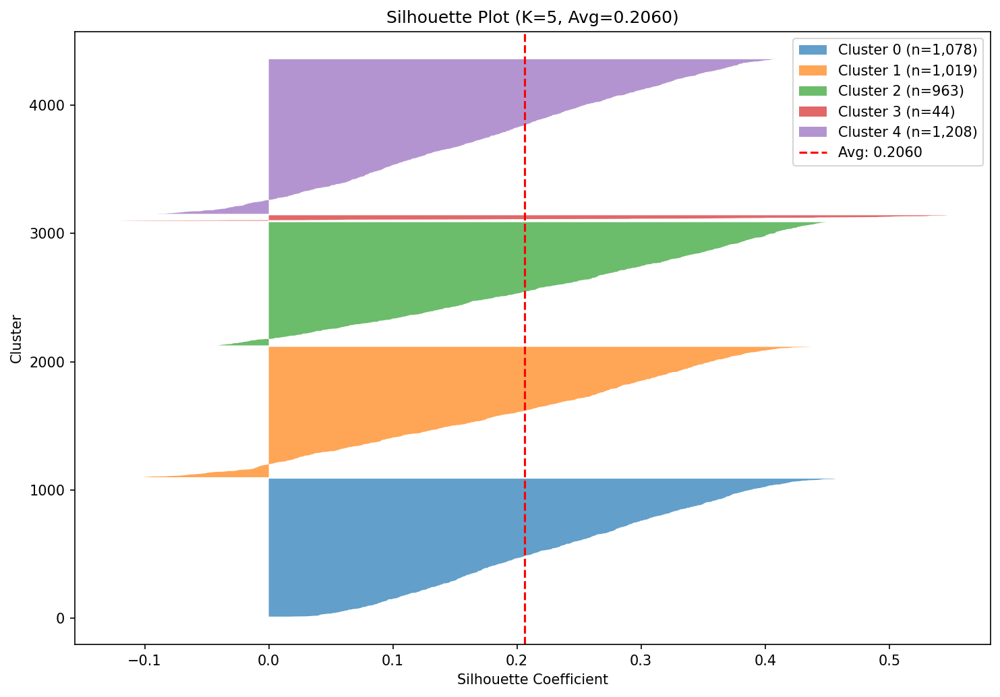

This chart shows the silhouette coefficient for every individual customer, grouped by cluster. Each horizontal bar represents one customer, with wider bars indicating better cluster fit. Clusters with bars extending far to the right are well-defined, while clusters with bars near zero or negative values contain customers that could plausibly belong to a different group. This visualization confirms that most customers are reasonably well-assigned.

### Cluster Centroids

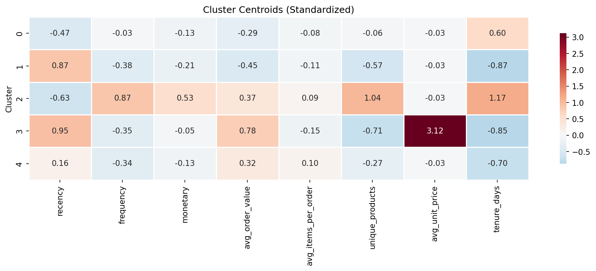

This heatmap shows the average (standardized) value of each feature for each cluster. Red cells indicate above-average values and blue cells indicate below-average. This is the "fingerprint" of each segment — for example, one cluster might be bright red for frequency and monetary (VIP customers) while another is bright red for recency (lapsed customers). This visualization makes it immediately clear how the segments differ from each other.

### Feature Distributions by Cluster

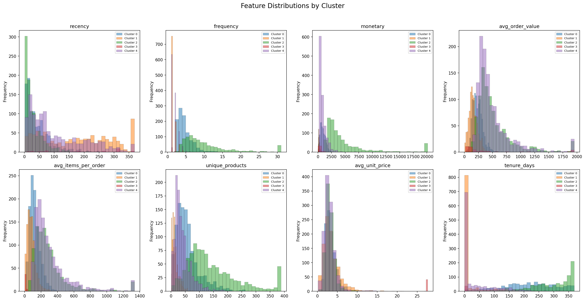

These eight panels show overlaid histograms for each feature, color-coded by cluster. They reveal not just the average differences between clusters (shown in the centroid heatmap above) but the full range of values within each segment. Some clusters are tightly concentrated while others span a wider range.

### Cluster Sizes

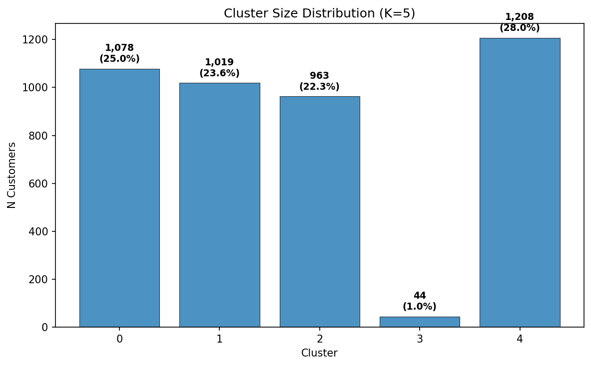

This bar chart shows how many customers fall into each cluster. The distribution is reasonably balanced across four of the five clusters (22-28% each), with one small niche cluster containing just 44 customers (1%). The balance is important — very imbalanced clusters can indicate the algorithm is not finding meaningful structure.

---

## Customer Profiles

### Radar Chart

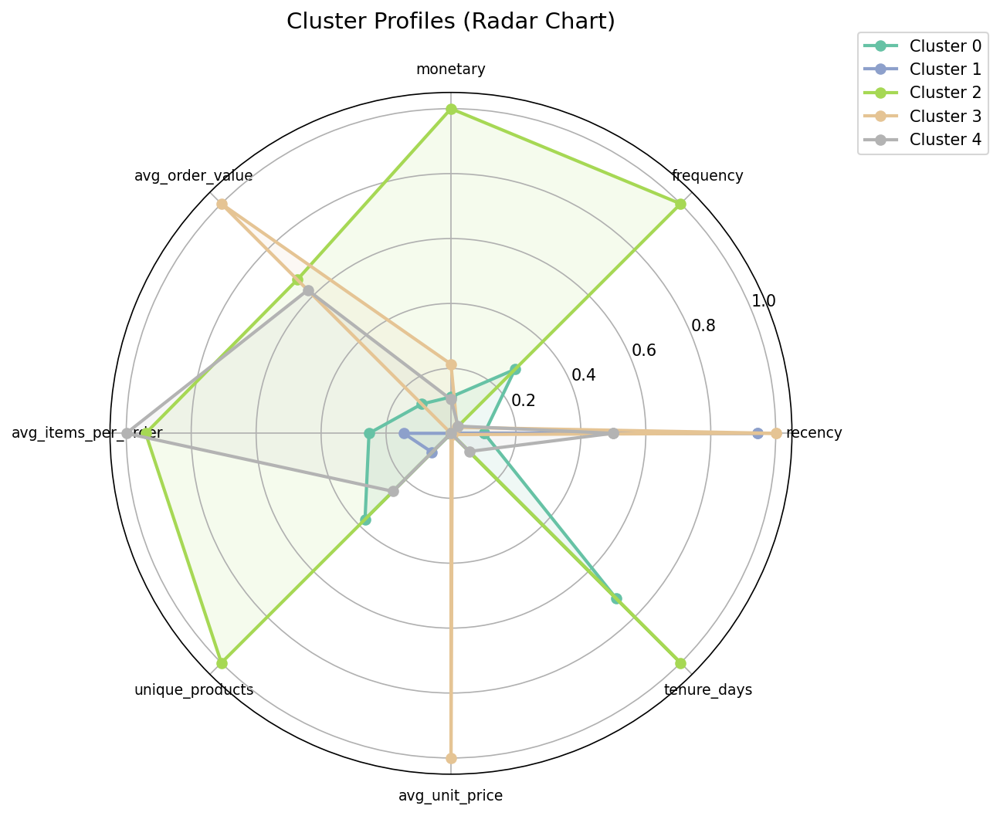

This polar plot compares all five segments simultaneously across the eight behavioral features, with values normalized to a 0-1 scale. Each cluster's "shape" reveals its character at a glance — the VIP segment (Cluster 2) creates a large polygon spanning most dimensions, while the Lapsed segment (Cluster 1) creates a small polygon concentrated near the center.

### Segment Summary

| Cluster | Name | Customers | % | Avg Recency | Avg Frequency | Avg Monetary | Key Trait |
|---------|------|-----------|---|-------------|---------------|-------------|-----------|
| 0 | Regular Buyers | 1,078 | 25.0% | 46 days | 4.2 orders | $933 | Steady, engaged customers |
| 1 | Lapsed Low-Value | 1,019 | 23.6% | 175 days | 1.4 orders | $201 | Inactive, single-purchase |
| 2 | VIP Champions | 963 | 22.3% | 30 days | 11.6 orders | $6,734 | High frequency, high value |
| 3 | High-Ticket Niche | 44 | 1.0% | 184 days | 1.6 orders | $1,593 | Extremely high unit prices ($644 avg) |
| 4 | Low-Frequency Bulk | 1,208 | 28.0% | 107 days | 1.7 orders | $883 | Very high items per order (416 avg) |

### Feature Distributions by Segment

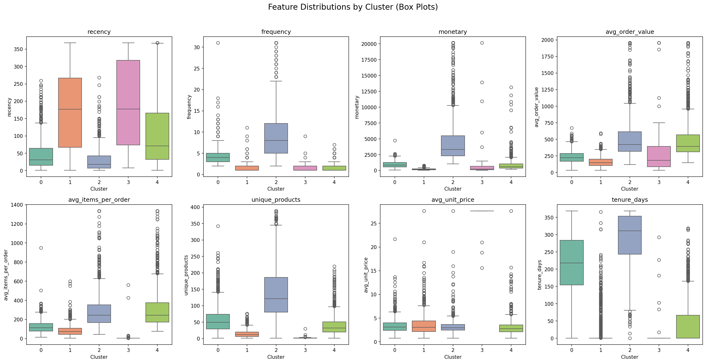

These box plots show the full distribution of each feature within each cluster. The boxes represent the middle 50% of customers, the line inside marks the median, and the whiskers extend to the full range (excluding outliers). This view reveals that VIP Champions (Cluster 2) consistently have the highest medians across spending-related dimensions, while Lapsed customers (Cluster 1) sit at the low end.

### Geographic Composition

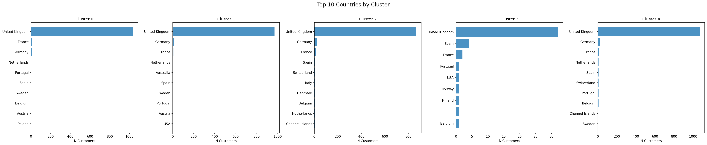

These five panels show the top 10 countries within each customer segment. The UK dominates all segments, but VIP Champions have slightly more international representation, suggesting that international customers who do engage tend to become high-value repeat buyers.

### Top Products by Segment

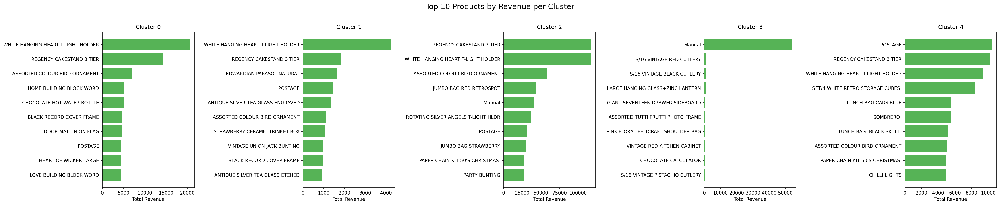

Each segment gravitates toward different products. These charts show the top 10 products by revenue within each cluster. VIP Champions spread their spending across a wide catalog, while Lapsed customers concentrate on just a few items. This product-level insight directly informs targeted marketing — different segments should receive different product recommendations.

### Purchase Timing Patterns

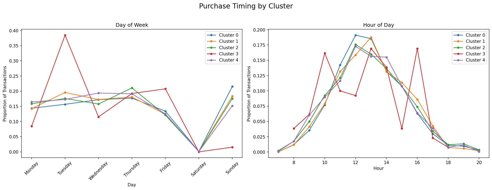

These two panels show when customers shop by day of week and hour of day. Most purchases happen during business hours (8 AM - 6 PM), with a slight mid-week peak. The timing patterns are relatively consistent across segments, suggesting that promotional emails and campaigns should target weekday mornings for maximum impact.

### Revenue Trends by Segment

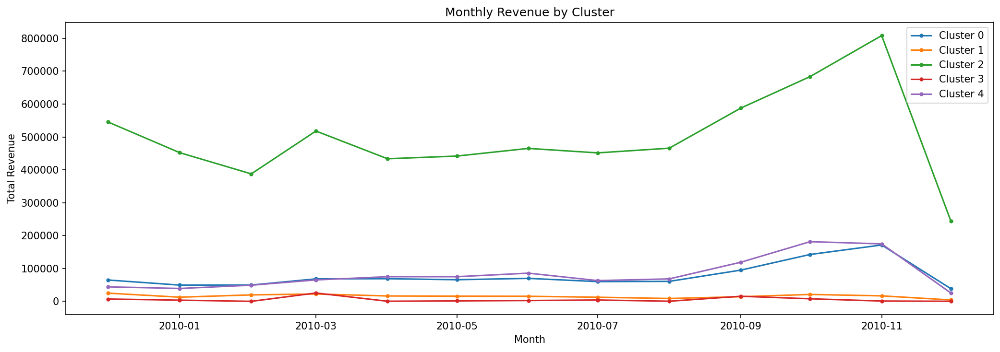

This time series shows monthly revenue contributed by each segment. VIP Champions (Cluster 2) contribute disproportionately to total revenue despite being only 22% of customers. The Lapsed segment's declining trend confirms they are disengaging. This chart makes the business case clear: retaining VIPs and re-engaging lapsed customers should be top priorities.

---

## Recommended Marketing Strategies

| Segment | Strategy | Tactics |
|---------|----------|---------|
| Regular Buyers | Loyalty & cross-sell | Loyalty programs, personalized recommendations based on purchase history, early access to sales |
| Lapsed Low-Value | Win-back campaigns | "We miss you" emails with discount codes, showcase new products they have not seen |
| VIP Champions | Retain & reward | Exclusive early access, premium customer support, referral incentive programs |
| High-Ticket Niche | Dedicated service | Account management, bulk pricing options, custom product catalogs |
| Low-Frequency Bulk | Build frequency | Subscription offers, reorder reminders, volume discount tiers |

---

## Algorithm Comparison

### Metrics Comparison

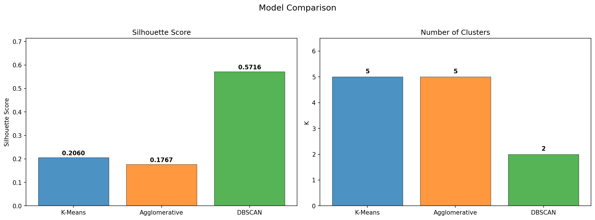

I validated the K-Means results by comparing against two alternative clustering algorithms. This chart compares their silhouette scores and cluster counts. While DBSCAN achieves the highest silhouette score (0.57), it does so by placing 98.6% of customers into a single cluster — which is useless for segmentation.

| Metric | K-Means (K=5) | Agglomerative (K=5) | DBSCAN |
|--------|--------------|-------------------|--------|
| Silhouette Score | 0.206 | 0.177 | 0.572 |
| Number of Clusters | 5 | 5 | 2 |
| Largest Cluster | 28.0% | 41.9% | 98.6% |
| Smallest Cluster | 1.0% | 1.0% | 0.3% |
| Noise Points | 0% | 0% | 1.2% |

### PCA Visualization

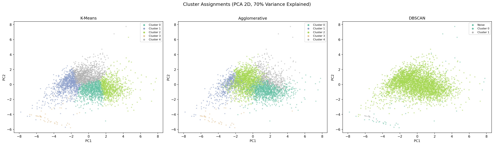

These three panels project the eight-dimensional customer data into two dimensions using PCA (Principal Component Analysis) for visual comparison. K-Means produces five visually distinct groups, Agglomerative Clustering creates less balanced groupings, and DBSCAN essentially draws one giant circle with a few outlier dots. This confirms that K-Means provides the most actionable segmentation.

### Hierarchical Structure

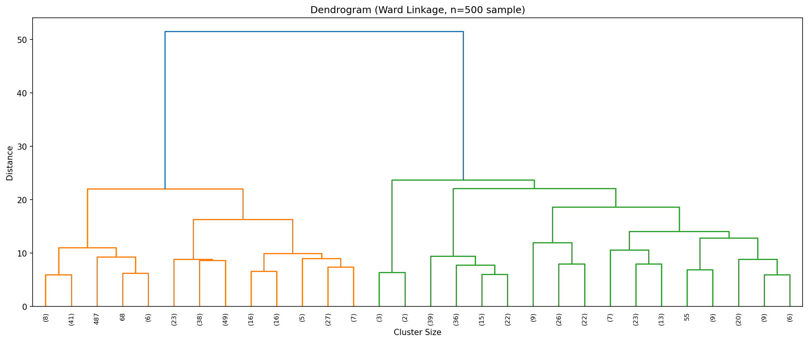

This dendrogram shows the hierarchical relationships between customers using the Agglomerative Clustering approach. It reads from bottom to top: customers who are most similar merge first (at the bottom), with increasingly different groups merging at higher levels. While informative for understanding the data's structure, the resulting clusters are less balanced than K-Means.

### Cluster Size Comparison

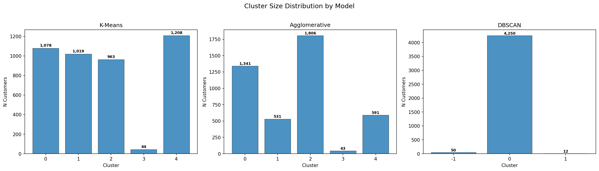

This side-by-side comparison of cluster sizes across all three algorithms drives home the key finding: K-Means produces the most balanced and actionable segmentation. Agglomerative Clustering lumps 42% of customers into a single group, and DBSCAN puts 99% in one cluster. For practical marketing applications, the five balanced K-Means segments are far more useful.

---

## Key Design Decisions

| Decision | Rationale |
|----------|-----------|
| RFM + 5 additional features | The classic Recency-Frequency-Monetary framework captures core behavior, but adding average order value, items per order, unique products, unit price, and tenure provides a richer picture that reveals segments RFM alone would miss (like the High-Ticket Niche). |
| Log transformation | Customer spending features are heavily right-skewed. Without log transformation, a handful of extreme spenders would dominate the clustering, producing one "big spender" cluster and one giant "everyone else" cluster. |
| Z-score standardization | K-Means uses distance calculations — without standardizing, features measured in dollars ($0-$349K) would overwhelm features measured in days (0-374). Standardizing ensures each feature contributes equally. |
| K=5 over K=2 | K=2 has a higher silhouette score but splits customers into just "active" and "inactive" — not useful for targeted marketing. K=5 reveals nuanced segments with distinct strategies. |
| K-Means over alternatives | DBSCAN's high silhouette score is misleading (98.6% in one cluster). Agglomerative produces imbalanced groups. K-Means provides the best combination of statistical quality, balanced segments, and business interpretability. |
